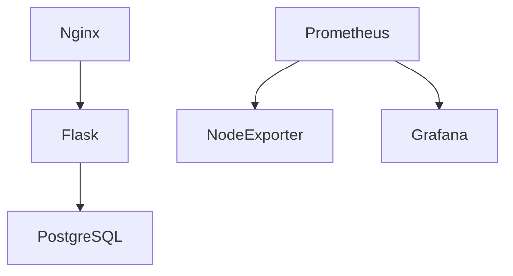

# Feedback App

## 📝 Опис
Це сучасний веб-додаток для збору, перегляду та аналітики відгуків користувачів. Архітектура побудована на Flask (Python), зберігання — PostgreSQL, фронтенд — HTML/CSS/JS, контейнеризація — Docker, веб-сервер — Nginx. Весь процес розгортання автоматизовано через Jenkins CI/CD, а моніторинг здійснюється за допомогою Prometheus та Grafana. Додаток підтримує автоматичний ролбек, гнучке управління версіями, повний моніторинг та просте адміністрування.

---

## 📁 Структура проекту
```
feedback-app/
├── app/                    # Основний код Flask-додатку
│   ├── __init__.py         # Ініціалізація Flask
│   ├── models.py           # Моделі БД
│   ├── routes.py           # Маршрути
│   ├── forms.py            # Форми
│   ├── config.py           # Конфігурація
│   ├── static/             # CSS, JS
│   └── templates/          # HTML-шаблони
├── nginx/                  # Nginx-конфігурації
├── monitoring/             # Prometheus, Grafana, Node Exporter
├── docker-compose.yml      # Docker Compose (розробка)
├── docker-compose.prod.yml # Docker Compose (продакшн)
├── Dockerfile              # Dockerfile для Flask
├── Jenkinsfile             # Jenkins pipeline (CI/CD)
├── requirements.txt        # Python-залежності
├── run.py                  # Точка входу Flask
├── init_db.py              # Ініціалізація БД
└── create_admin_user.py    # Створення адміністратора
```

---

## 🏗️ Архітектура та сервіси
- **Flask** — основний веб-додаток (API, логіка, автентифікація, адмін-панель)
- **PostgreSQL** — зберігання даних
- **Nginx** — реверс-проксі, HTTPS, статика
- **Prometheus** — збір метрик (Flask, Node Exporter)
- **Grafana** — дашборди для моніторингу
- **Node Exporter** — системні метрики EC2
- **Docker Compose** — оркестрація всіх сервісів

---

## 🚀 CI/CD та деплой (Jenkins)
### Основні етапи пайплайну
1. **Перевірка параметрів** (EC2, DockerHub, секрети)
2. **Підготовка коду** (архівування, перевірка)
3. **Очищення EC2** (FORCE_CLEANUP — повне очищення Docker-ресурсів)
4. **Передача архіву на EC2**
5. **Розпакування, налаштування .env** (секрети, змінні)
6. **Завантаження образу з DockerHub** (або збірка, якщо потрібно)
7. **Запуск через docker-compose.prod.yml**
8. **Перевірка статусу, портів, логів**
9. **Пуш образу в DockerHub** (якщо не пропущено)
10. **Моніторинг фінального стану**

### Параметри Jenkins pipeline
- `EC2_IP` — IP-адреса EC2
- `EC2_USER` — користувач EC2
- `FORCE_REBUILD` — примусове перебудування образу
- `FORCE_CLEANUP` — повне очищення Docker на EC2
- `FORCE_ROLLBACK` — відкат до попередньої версії
- `ROLLBACK_TAG` — тег DockerHub для ролбеку (за замовчуванням latest)
- `SKIP_DOCKERHUB` — не пушити образ у DockerHub

### Rollback
- **Автоматичний** — при помилці деплою, EC2 завжди піднімається з останнього стабільного образу з DockerHub
- **Ручний** — активуйте `FORCE_ROLLBACK`, вкажіть `ROLLBACK_TAG` (опціонально), запустіть пайплайн
- **Після rollback** — всі сервіси стартують, .env оновлюється, моніторинг працює

---

## ⚙️ Налаштування та секрети
- `SECRET_KEY` — Flask-секрет
- `POSTGRES_PASSWORD` — пароль до PostgreSQL
- `ADMIN_PASSWORD` — пароль адміністратора
- Всі секрети зберігаються у Jenkins Credentials та автоматично пишуться у .env на EC2

---

## 🛡️ Безпека
- HTTPS (Nginx)
- Захищені змінні середовища (Jenkins)
- Паролі не зберігаються у репозиторії
- Захист від CSRF
- Доступ до адмін-панелі лише для авторизованих

---

## 📊 Моніторинг та дашборди
- **Prometheus**: збір метрик з Flask (`/metrics`) та Node Exporter
- **Grafana**: автооновлювані дашборди (CPU, RAM, диск, кількість відгуків)
- **Healthcheck**: `/health` (Flask), статуси контейнерів, порти
- **Дашборди**: `monitoring/grafana/provisioning/dashboards/`
- **Джерела даних**: `monitoring/grafana/provisioning/datasources/`
- **Автооновлення**: кожні 5 секунд

---

## 🛠️ Управління на EC2
```bash
# Перевірка статусу
cd /home/<EC2_USER>/feedback-app-deploy
docker-compose -f docker-compose.prod.yml ps

# Перегляд логів
docker-compose -f docker-compose.prod.yml logs

# Перезапуск
docker-compose -f docker-compose.prod.yml restart

# Зупинка
docker-compose -f docker-compose.prod.yml down

# Очищення Docker
sudo docker system prune -f
```

---

## 🧑‍💻 Ручне розгортання (dev/test)
1. Клонуйте репозиторій
2. Встановіть залежності:
```bash
python -m venv .venv
.venv\Scripts\activate     # Windows
pip install -r requirements.txt
```
3. Ініціалізуйте БД та створіть адміністратора:
```bash
python init_db.py
python create_admin_user.py
```
4. Запустіть через Docker:
```bash
docker-compose -f docker-compose.prod.yml up -d
```

---

## 🧩 Контейнери та мережа

- Всі сервіси ізольовані у власній мережі Docker
- Nginx відкриває лише 80/443, інші порти — лише для внутрішньої взаємодії

---

## 📦 DockerHub
- Пушиться лише Flask-образ (`justendray/feedback_app:<tag>`)
- EC2 завжди тягне образ з DockerHub (деплой і rollback)
- Теги відповідають номеру збірки Jenkins

---

## 📝 Корисні посилання
- **Головний сайт**: http://<EC2_IP>
- **Адмін-панель**: http://<EC2_IP>/feedback_page
- **Healthcheck**: http://<EC2_IP>/health
- **Prometheus**: http://<EC2_IP>:9090
- **Grafana**: http://<EC2_IP>:3000

---

## 👤 Автор
Andrew Pastushuk